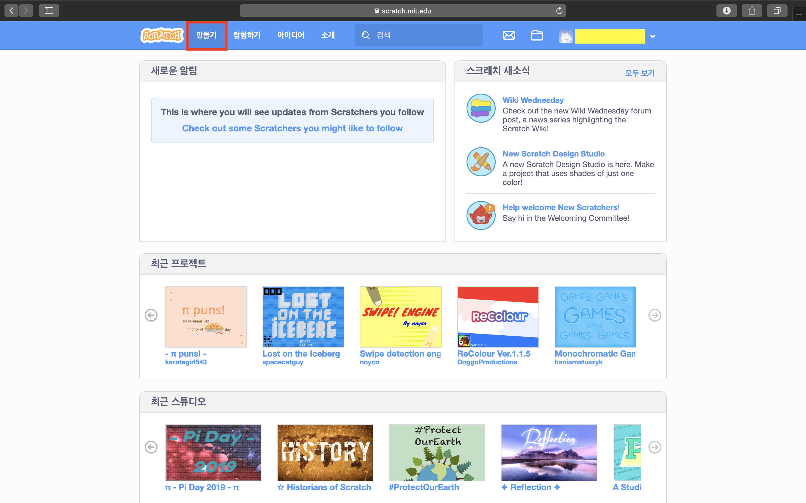

# 스크래치 STEP1.

### *동작블럭에 대해 알아봅시다*

## 프로젝트 생성하기
- 주소창에 https://scratch.mit.edu 를 입력하여 접속합니다
- 구글, 네이버 등 검색 사이트에 '스크래치'를 검색하여 접속합니다

- 로그인을 하여  화면의 노란 부분에 자신의 아이디가 보이도록 합니다
- 상단 메뉴에서 '만들기'를 클릭하여 만들기 메뉴로 들어갑니다

## 프로젝트 만들기
