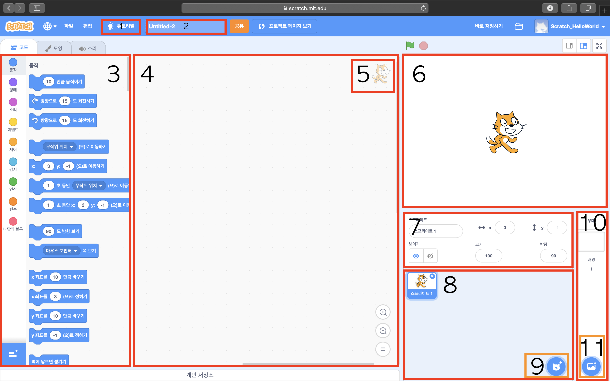

# 스크래치 시작하기

### *스크래치에 대해 알아봅시다*

## 스크래치 접속

- 주소창에 https://scratch.mit.edu 를 입력하여 접속합니다
- 구글, 네이버 등 검색 사이트에 '스크래치'를 검색하여 접속합니다

## 스크래치 메뉴

### 만들기

- 작품을 만들 수 있는 메뉴입니다

### 탐험하기

- 다른사람들이 만든 프로젝트 체험할 수 있는 메뉴입니다
- '리믹스' 기능을 이용하여 다른사람의 프로젝트가 어떻게 만들어졌는지 살펴보고 수정해볼 수 있습니다

### 아이디어

- 스크래치를 처음 시작할 때 유용한 메뉴입니다
- 다양한 튜토리얼을 체험할 수 있습니다

### 소개

- 스크래치에 대한 다양한 내용을 볼 수있는 메뉴입니다

## 스크래치 가입하기

- 스크래치에 가입하면 언제 어디서든 로그인 만으로 내작품을 저장하고 살펴볼 수 있습니다

- 스크래치 홈화면에서 스크래치 가입 버튼을 클릭합니다

- 자신이 사용할 아이디와 비밀번호를 설정합니다
  - 아이디는 영문, 숫자, 특수문자(-, _) 로 구성합니다
  - 누군가 이미 사용하고 있는 아이디는 만들 수 없습니다
  - 비밀번호는 6자리 이상부터 설정이 가능합니다
  - 아이디와 비밀번호를 잃어버리지 않게 꼭 기억하도록 합니다

- 자신의 정보를 입력합니다 (생년월일, 성별, 국가)
  - 국가는 'South Korea'를 찾아 선택합니다

- 부모님 또는 보호자 이메일 주소를 입력합니다
  - 두칸의 이메일이 일치해야 합니다
  - 공유기능을 이용하려면 이메일 인증이 필요하니 정확한 이메일을 입력하세요

- 위와 같은 화면이 나오면 가입이 완료된 것입니다
- 설정한 아이디와 비밀번호를 이용해 로그인하세요
- **여러사람이 사용하는 공용PC에서는 자동로그인 기능을 사용하지 마세요**

## 프로젝트 만들기

- 로그인을 했다면 화면의 노란 부분에 자신의 아이디가 적혀있습니다
- 상단 메뉴에서 '만들기'를 클릭하여 만들기 메뉴로 들어갑니다

- 노란색 박스의 글자들이 영어로 보인다면 빨간박스를 클릭하여 언어를 '한국어'로 바꿔주세요

1. 튜토리얼 : 스크래치 첫 사용자라면 튜토리얼을 이용해보세요
2. 제목 : 프로젝트의 제목을 설정하는 부분입니다
3. 블록 : 사용할 수있는 블럭들의 목록입니다
4. 코딩하는 곳 : 블럭들을 가져와 조립하는 공간입니다
5. 선택된 스프라이트 : 현재 선택된 스프라이트 입니다 늘 어떤 스프라이트가 선택됬는지 확인하고 코딩을 진행하세요
6. 무대 : 프로젝트가 보여지는 화면입니다 배경과 다양한 스프라이트를 추가할 수 있습니다
7. 스프라이트 : 선택된 스프라이트의 정보를 보여줍니다 크기, 위치 등을 변경할 수 있습니다
8. 스프라이트 목록 : 불러와진 모든 스프라이트가 보여집니다
9. 스프라이트 추가하기 : 스프라이트를 가져오거나, 선택하거나 그릴 수 있습니다
10. 배경 : 현재 배경이 보여집니다, 배경을 클릭하여 코딩할 수 있습니다
11. 배경 추가하기 : 배경을 가져오거나, 선택하거나 그릴 수 있습니다