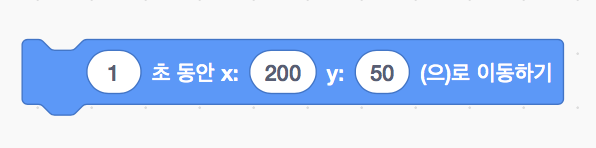
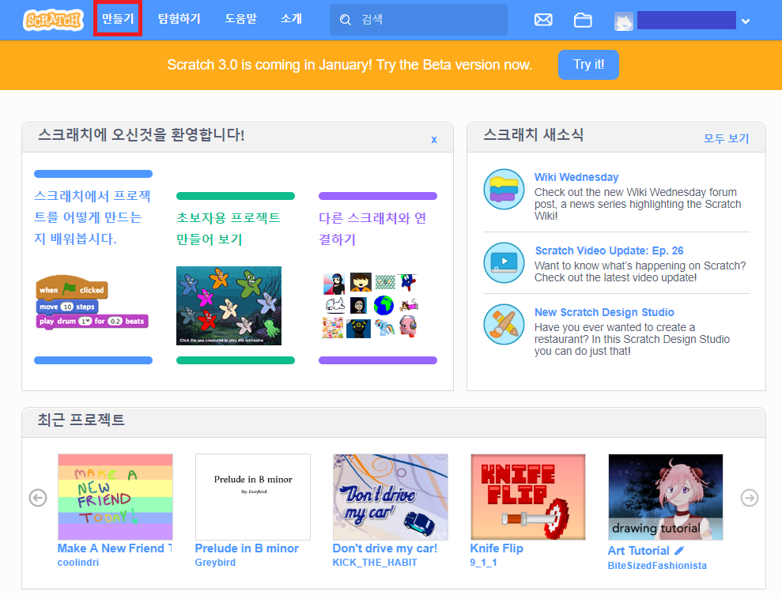

> [참조링크](https://scratch.mit.edu/projects/172506708/)
>
> 스크래치2.0과 스크래치3.0 beta (scratch3.0 beta)를 사용하여 제작한 자료입니다

# 스크래치 1강

### *공을 클릭하여 던지기 (Throw the ball)*

## 재료블록

### 동작

#### 좌표로 이동하기 (x:*30* y:*100* 로 이동하기)

- 스프라이트의 위치를 지정합니다

#### 정해진 시간동안 좌표로 이동하기(*1* 초 동안 x:*200* y:*50* (으)로 이동하기)

- 지정한 시간동안 지정한 위치로 스프라이트가 이동합니다

### 이벤트

#### 스프라이트 클릭 동작 (이 스프라이트를 클릭했을 때)

- 스프라이트가 클릭될 때 실행할 동작을 지정합니다

#### 키 누름 동작 (*스페이스* 키를 눌렀을 때)

- 특정 키를 눌렀을 때의 동작을 지정합니다

## 프로젝트 만들기

### 새로운 프로젝트 만들기

- 새로운 프로젝트를 생성합니다.

### 배경 바꾸기

- 배경 고르기메뉴를 누르고 스포츠 탭에서 'Playing Field' 배경을 선택합니다

- 배경을 업로드하고 기존의 하얀 배경을 삭제합니다

### 스프라이트 만들기

- 스프라이트 고르기 메뉴에서 'Ball'과 'Bowl' 스프라이트를 추가합니다

- 기본 스프라이트(스프라이트1)를 삭제합니다

- 스프라이트를 우클릭하여 복사버튼으로 'Ball'과 'Bawl'스프라이트를 각각 3개씩 복사해 줍니다
- 공의 색상은 스프라이트를 클릭한 후 모양탭에서 고를 수 있습니다

### 스프라이트 동작 지정하기

- 알맞은 블럭을 사용하여 각 스프라이트의 동작을 지정합니다

## 사용해보기

- 깃발 버튼을 누르고 각각의 공을 눌러 바구니에 넣어보세요

- 스페이스 버튼을 눌러 공을 원위치로 되돌려보세요

[프로젝트 예제](https://scratch.mit.edu/projects/267616396/)
