> [참조링크](https://scratch.mit.edu/projects/174334392/)
>
> 스크래치2.0과 스크래치3.0 beta (scratch3.0 beta)를 사용하여 제작한 자료입니다

# 스크래치 19강

### 복제 로봇 만들기 (Robot Factory)

## 수업목표

- 복제 블럭을 사용해 봅시다

## 재료준비

[건반 알아보기]

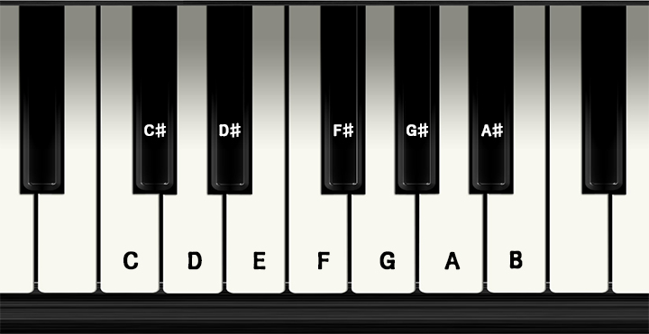

## 재료블록

### 동작

#### 좌표로 이동하기 (x:*140* y:*0* 로 이동하기)

- 블럭들의 위치를 지정합니다

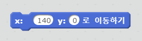

### 형태

#### 순서 바꾸기 (맨 앞으로 순서 바꾸기)

- 블럭들의 순서를 조정합니다

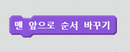

#### 모양 바꾸기 (다음 모양으로 바꾸기)

- 블럭의 모양을 바꿔줍니다

  !  '**다음 모양으로 바꾸기**' 블럭과 '**모양을 *keyboard* (으)로 바꾸기**' 블럭을 비교해 봅시다

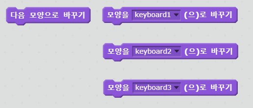

### 소리

#### 재생하기 (*팝* 재생하기)

- 소리를 재생합니다

  ! '***팝* 재생하기**' 블럭과 '***팝* 끝까지 재생하기**' 블럭을 비교해 봅시다

  ! 비교가 어렵다면 조금더 긴 음악으로 비교해 봅시다

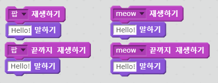

#### 모든 소리 끄기

- 소리를 끄고 싶을때 사용합니다

#### 타악기 연주 (*4*번 타악기를 *0.25* 박자로 연주하기)

- 악기를 고르고 박자를 지정합니다

  ! 여러가지 악기를 사용해 봅시다

#### 음을 지정하여 연주하기 (*60*번 음을 *0.5* 박자로 연주하기)

- 음과 박자를 지정하여 연주합니다

#### 악기 정하기 (*2*번 악기로 정하기)

- 음을 연주할 악기를 지정합니다

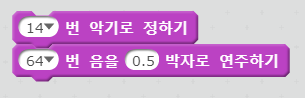

#### 박자의 빠르기 설정하기 (빠르기를 *60*bpm 으로 정하기) 

- 박자의 빠르기를 지정합니다

## 프로젝트 만들기

### 새로운 프로젝트 만들기

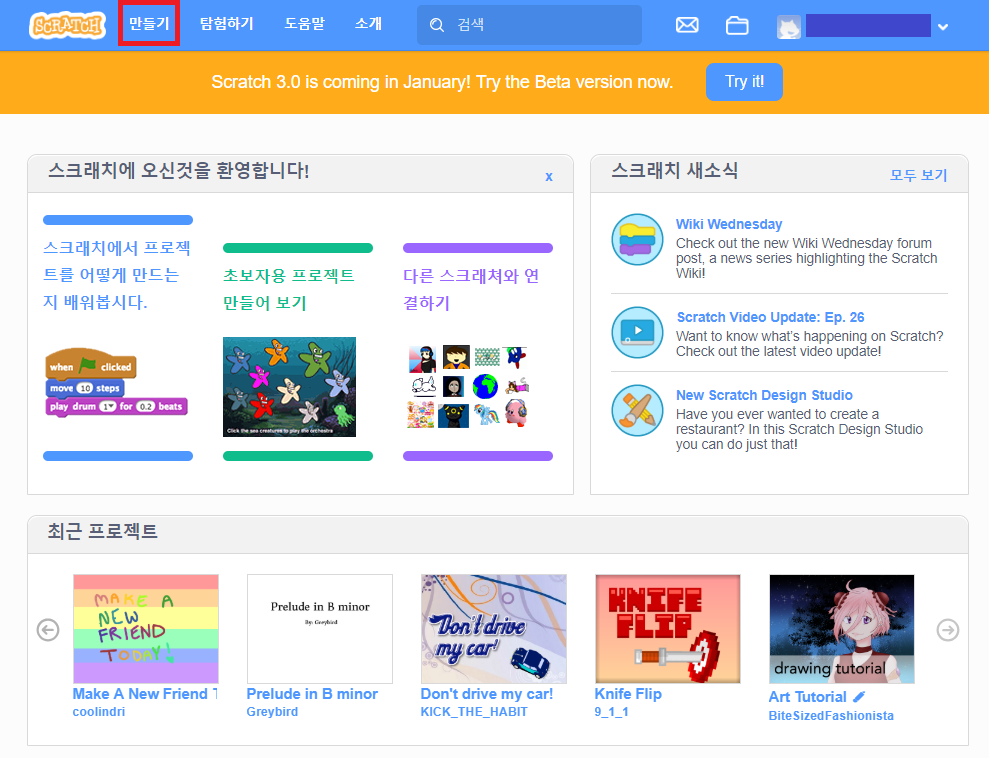

- 새로운 프로젝트를 생성합니다.

### 배경 바꾸기

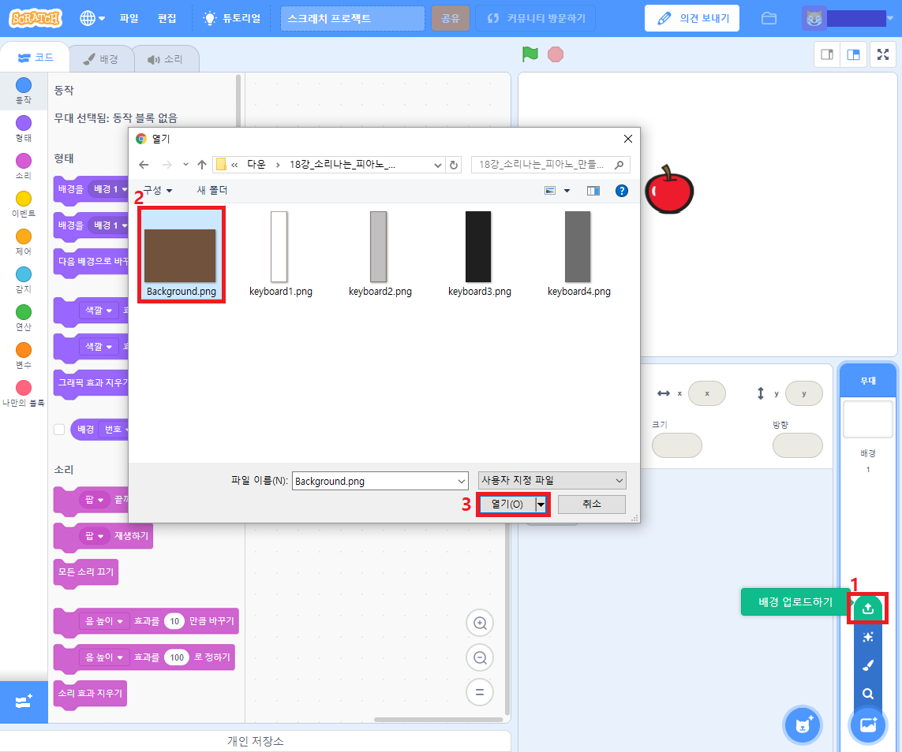

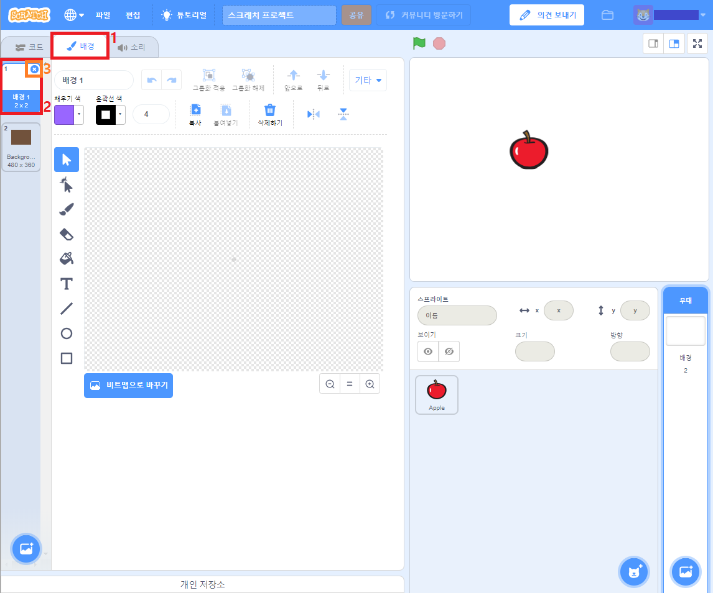

- 배경을 업로드하고 기존의 하얀 배경을 삭제합니다

### 스프라이트 만들기

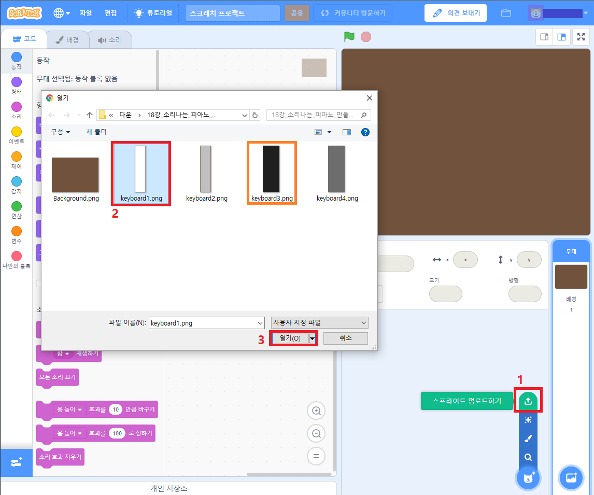

- 건반 스프라이트를 추가 합니다 (keyboard1, keyboard3)

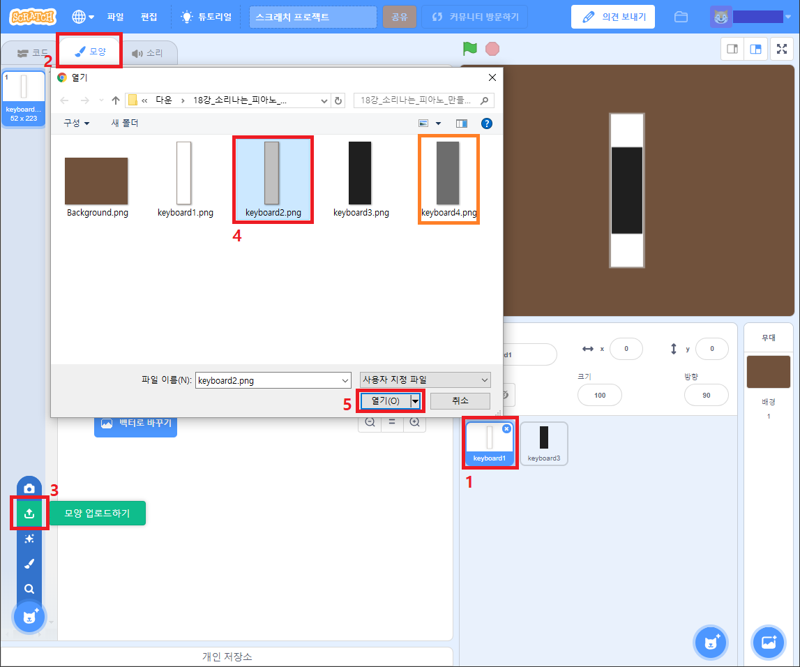

- 스프라이트 모양에서 눌린모양의 건반을 추가 합니다 (keyboard2, keyboard4)

### 스프라이트 이름 지정하기

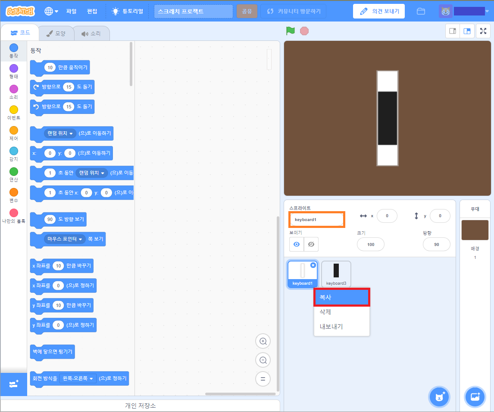

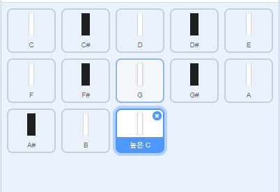

- 복사하기와 이름바꾸기로 스프라이트를 위와 같이 지정합니다

### 스프라이트 동작 지정하기

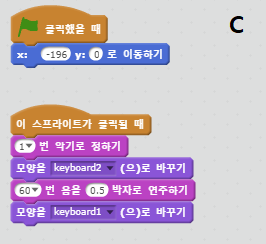
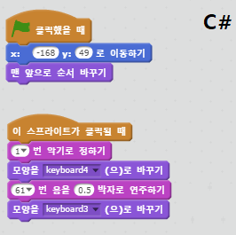
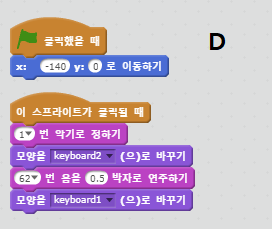
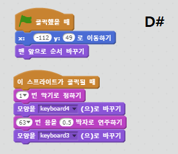
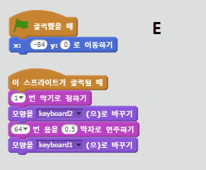
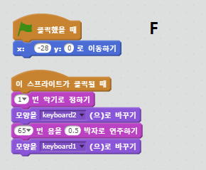
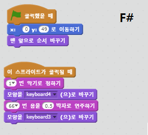
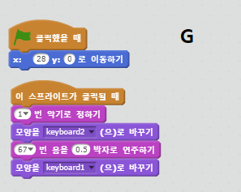
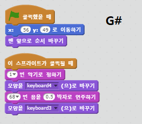
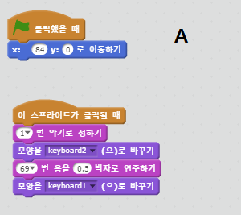
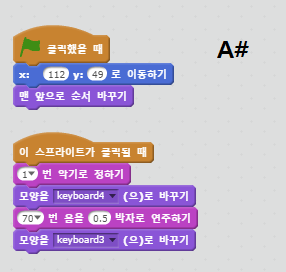
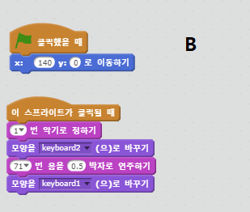
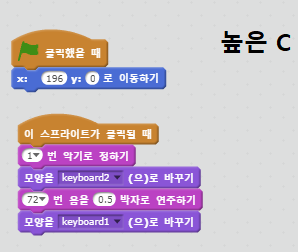

- 알맞은 블럭을 사용하여 각 스프라이트의 동작을 지정합니다

## 더 나아가기

- 깃발을 눌렀을때 노래가 나오도록 만들어 봅시다

- 노래가 나올때 학교배경이 나오도록 만들어 봅시다
- 다양한 기능을 추가해 봅시다

[프로젝트 예제](https://scratch.mit.edu/projects/260312444/)

#### 학교종이 땡땡땡 계이름

> G  G  A  A   G  G  E   G  G  E  E  D
>
> 학 교 종 이 땡 땡 땡 어 서 모 이 자
>
> G  G  A  A   G  G  E   G  E  D  E  C
>
> 선 생 님 이 우 리 를 기 다 리 신 다

