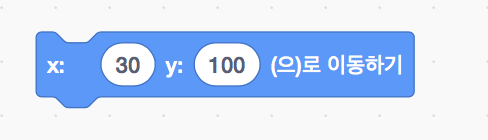
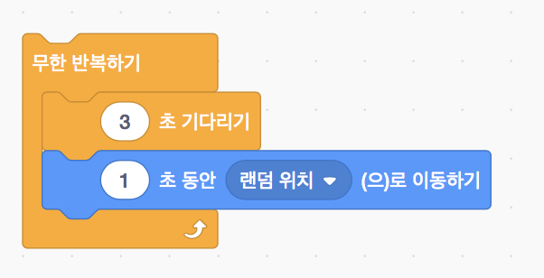

> [참조링크](https://scratch.mit.edu/projects/172173169/)
>
> 스크래치2.0과 스크래치3.0 beta (scratch3.0 beta)를 사용하여 제작한 자료입니다

# 스크래치 20강

### 풍선 터트리기 (Balloon clicker)

## 수업목표

- 다양한 블록을 이용하여 풍선 터트리기 게임을 만들어 봅시다.

## 재료준비

[재료 다운로드](https://github.com/su-bin/passion/raw/master/scratch/project_resources/20_Balloon_clicker.zip)

## 재료블록

### 동작

#### 좌표로 이동하기 (x:*30* y:*100* (으)로 이동하기)

- 스프라이트의 위치를 지정합니다

#### 움직이기 (*10* 만큼 움직이기)

- 스프라이트가 바라보는 방향으로 10만큼 움직입니다

#### 정해진 시간동안 좌표로 이동하기(*1* 초 동안 x:*200* y:*50* (으)로 이동하기)

- 지정한 시간동안 지정한 위치로 스프라이트가 이동합니다

#### 좌표 확인하기 (x좌표, y좌표)

- 무대에 x좌표와 y좌표가 표시됩니다

#### 튕기기 (벽에 닿으면 튕기기)

- 스프라이트가 벽에 닿으면 튕기게 됩니다

### 이벤트

#### 스프라이트 클릭 동작 (이 스프라이트가 클릭될 때)

- 스프라이트가 클릭될 때 실행할 동작을 지정할 수 있습니다

#### 방송하기 (*메시지1* 방송하기 / *메시지1* 받았을 때)

- 메시지를 방송하고 방송을 받았을때 동작을 지정할 수 있습니다

### 형태

#### 일정 시간동안 말하기 (*안녕!* 을(를) *2*초 동안 말하기)

- 스프라이트가 지정한 시간동안 말합니다

#### 보이기 숨기기 (보이기, 숨기기)

- 스프라이트를 보이거나 숨깁니다

#### 모양 바꾸기 (다음 모양으로 바꾸기)

- 스프라이트를 다음 모양으로 변경합니다

#### 크기 정하기 (크기를 *500*%로 정하기)

- 스프라이트의 크기를 조정합니다

### 제어

#### if 조건문 (만약 *조건* 이라면)

- 조건이 참(사실, true)이면 조건문 안의 블럭을 실행합니다 

#### 무한 반복하기

- 무한 반복하기 안의 블럭을 계속해서 반복합니다

#### 기다리기 (*3* 초 기다리기)

- 지정한 시간동안 기다립니다

#### 복제 블록 (*나 자신* 복제하기 / 복제되었을 때 / 이 복제본 삭제하기)

- *스프라이트* 복제하기 : 해당 스프라이트를 복제합니다
- 복제되었을 때 : 복제되었을 때의 동작을 지정합니다
- 이 복제본 삭제하기 : 복제된 스프라이트를 삭제합니다

### 연산

#### 비교하기

- 두개의 값을 비교하여 참, 거짓을 판별합니다

#### 난수 (*1* 부터 *10* 사이의 난수)

- 지정한 범위 안에서 난수를 생성합니다

### 변수

#### 변수 (변수 정하기 / 변수 바꾸기 / 변수 보이기 / 변수 숨기기)

- 변수명을 지정하여 변수를 만들고 변수의 값을 다양하게 변경합니다

## 프로젝트 만들기

### 새로운 프로젝트 만들기

- 새로운 프로젝트를 생성합니다.

### 배경 바꾸기

- 배경을 업로드하고 기존의 하얀 배경을 삭제합니다

### 스프라이트 만들기

#### 1. 라이브러리 사용하기

- 스프라이트 고르기를 클릭합니다

- '모두' 항목의 'Balloon1' 스프라이트와 '동물' 항목의 'Parrot' 스프라이트를 추가합니다

#### 2. 스프라이트 업로드하기

- 'balloon1-a' 와 'parrot-a' 를 추가합니다

- 'balloon1-a' 스프라이트의 모양탭에서 다른 색의 풍선을 추가 합니다 (balloon1-b, balloon1-c)

  ! 크기가 너무 크다면 스프라이트를 클릭하고 조절해주세요

- 'parrot-a' 스프라이트의 모양탭에서 다른 모양의 parrot을 추가 합니다 (parrot-b)

  ! 크기가 너무 크다면 스프라이트를 클릭하고 조절해주세요

### 스프라이트 동작 지정하기

- 알맞은 블럭을 사용하여 배경과 각 스프라이트의 동작을 지정합니다

## 더 나아가기

- 새가 자유롭게 날아다니도록 해봅시다
- 풍선을 놓칠때마다 배경이 어두워지도록 해봅시다
- 풍선을 놓치면 새가 복제되도록 해봅시다

[프로젝트 예제](https://scratch.mit.edu/projects/265332029/)
