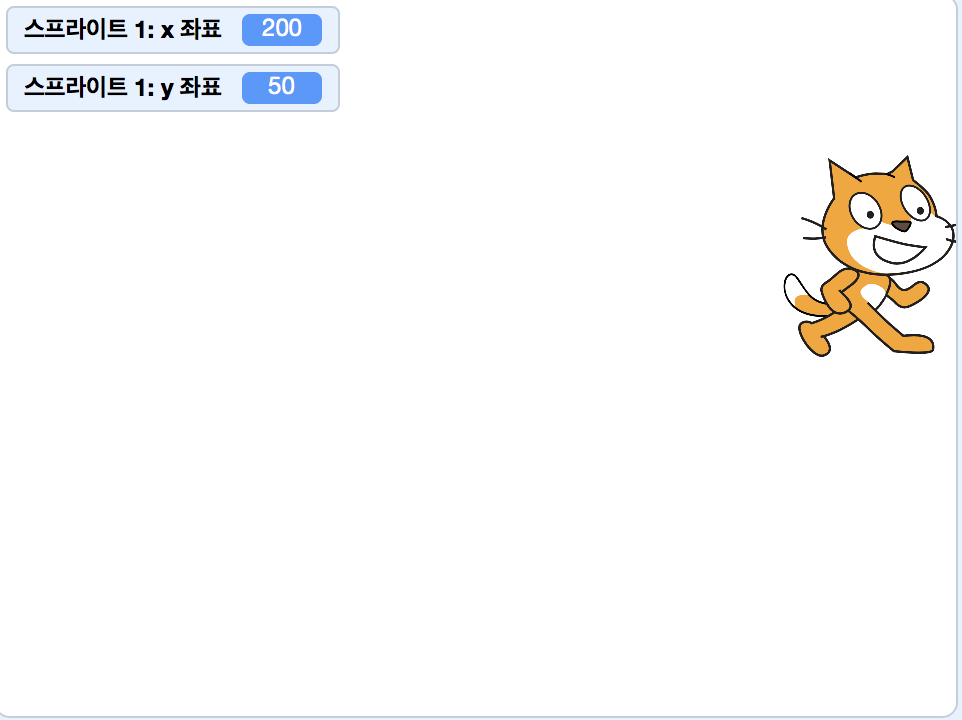
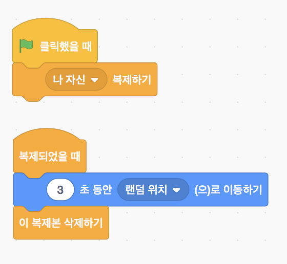
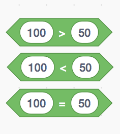

> [참조링크](https://scratch.mit.edu/projects/172169183/)
>
> 스크래치2.0과 스크래치3.0 beta (scratch3.0 beta)를 사용하여 제작한 자료입니다

# 스크래치 21강

### 날아오는 운석 피하기 (Space Adventure)

## 수업목표

- 다양한 블록을 이용하여 운석 피하기게임을 만들어 봅시다.

## 재료준비

스크래치에서 제공하는 재료들을 사용합니다

## 재료블록

### 동작

#### 좌표로 이동하기 (x:*30* y:*100* (으)로 이동하기)

- 스프라이트의 위치를 지정합니다

#### 정해진 시간동안 좌표로 이동하기(*1* 초 동안 x:*200* y:*50* (으)로 이동하기)

- 지정한 시간동안 지정한 위치로 스프라이트가 이동합니다

#### 좌표 확인하기 (x좌표, y좌표)

- 무대에 x좌표와 y좌표가 표시됩니다

#### 좌표 이동하기 (좌표를 *10*만큼 바꾸기)

- x 또는 y 좌표의 값을 지정한만큼 바꿔줍니다

### 이벤트

#### 방송하기 (*메시지1* 방송하기 / *메시지1* 받았을 때)

- 메시지를 방송하고 방송을 받았을때 동작을 지정할 수 있습니다

### 형태

#### 보이기 숨기기 (보이기, 숨기기)

- 스프라이트를 보이거나 숨깁니다

#### 크기 정하기 (크기를 *500*%로 정하기)

- 스프라이트의 크기를 조정합니다

#### 효과 바꾸기 (*색깔* 효과를 *25* 만큼 바꾸기)

- 선택한 효과를 지정한 숫자만큼 바꿔줍니다

#### 모양 바꾸기 (다음 모양으로 바꾸기)

- 스프라이트를 다음 모양으로 변경합니다

### 제어

#### 무한 반복하기

- 무한 반복하기 안의 블럭을 계속해서 반복합니다

#### if 조건문 (만약 *조건* 이라면)

- 조건이 참(사실, true)이면 조건문 안의 블럭을 실행합니다 

#### if 조건문 (만약 *조건* 이라면 / 아니면)

- 조건이 참(사실, true)이면 조건문 안의 블럭을 실행하고 거짓이면 '아니면' 안의 블럭을 실행합니다

#### 기다리기 (*3* 초 기다리기)

- 지정한 시간동안 기다립니다

#### 복제 블록 (*나 자신* 복제하기 / 복제되었을 때 / 이 복제본 삭제하기)

- *스프라이트* 복제하기 : 해당 스프라이트를 복제합니다
- 복제되었을 때 : 복제되었을 때의 동작을 지정합니다
- 이 복제본 삭제하기 : 복제된 스프라이트를 삭제합니다

### 감지
####  닿았는지 감지하기 (*마우스 포인터* 에 닿았는가?)

- 선택한 대상에 닿았는지 감지합니다

####  키보드 감지 (*스페이스* 키를 눌렀는가?)
- 선택한 키가 눌렸는지 감지합니다

### 연산

#### 비교하기

- 두개의 값을 비교하여 참, 거짓을 판별합니다

#### 난수 (*1* 부터 *10* 사이의 난수)

- 지정한 범위 안에서 난수를 생성합니다

## 프로젝트 만들기

### 새로운 프로젝트 만들기

- 새로운 프로젝트를 생성합니다.

### 배경 바꾸기

- 배경 고르기에서 우주배경을 고르고 기존의 하얀 배경을 삭제합니다

### 스프라이트 만들기

#### 라이브러리 사용하기

- 스프라이트 고르기를 클릭합니다

- '모두' 항목의 'Rocketship'과 'Rocks' 스프라이트를 추가합니다

- 스프라이트를 선택하고 크기를 줄여줍니다

- 'rocks' 스프라이트를 클릭하고 모양탭에 들어가서 스프라이트 모양을 복사해줍니다

- 채우기를 이용하여 스프라이트를 자유롭게 꾸며줍니다

### 스프라이트 동작 지정하기

- 알맞은 블럭을 사용하여 배경과 각 스프라이트의 동작을 지정합니다

## 더 나아가기

- 우주선이 위아래 방향으로도 움직일 수 있게 해봅시다
- 우주선이 레이저를 쏴서 바위를 처치할 수 있게 해봅시다
- 바위에 5번 이상 닿으면 게임이 종료되도록 해봅시다

[프로젝트 예제](https://scratch.mit.edu/projects/266055815/)